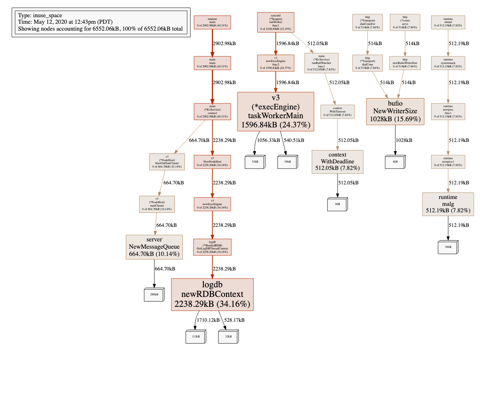

<div align="center">
   
	<br>
</div>

# Roo (Beta)

**TL;DR** This basically lets you run your own load balanced Amazon AWS ECS clusters on your own hardware, with no configuration (no additional setup for clustered kv stores, no janky config files, no defining providers, no dodgy second hand helm charts etc). I setup a cluster, and publish a new domain in around 30 seconds now.

[See a line-by-line run-through example setup](https://github.com/sfproductlabs/roo#getting-started-complete-run-through-example-on-hetzner)

This aims to be a free replacement of Amazon's ECS (Elastic Compute Service), EKS (Kubernetes), CertificateManager, Load-Balancer and CloudWatch using your own Docker Swarm. It IS a complete replacement for nginx, traefik, haproxy, and a lot of kubernetes. The idea is to give developers back the power and take it back from ridiculous self-complicating dev-ops tools that get more complicated and less useful (for example Traefik 2 just removed support for clustered Letsencrypt from their open source version to spruik their enterprise version. Nginx and HAProxy do the same). I wasted a lot of time on their software before writing this. I truly hope it benefits others too.

If you are unfamiliar with swarm/kubernetes and are a developer and want a quick intro into how powerful and easy swarm can be, [see how you can setup a thousand-machine cluster in just 20 lines](https://github.com/sfproductlabs/scrp#running-on-docker-swarm) (just copy + paste from there) or [check out my command notes](https://github.com/sfproductlabs/haswarm/blob/master/README.md). In a day I was scaling clusters up and down on my own infrastructure with single commands.

The power Roo gives you is to add HTTPS://example1.com and HTTPS://example2.com to your clustered services with zero configuration. Let's encrypt allocates your service's certificates. It works across every machine, docker node, service, in your cluster.

Roo itself is clustered. Every machine it runs on shares the load to your services. It's distributed store shares certificates from Letsencrypt used across all your nodes. Now apple is denying certificates older than a year, I feel as a dev, that lets encrypt is almost mandatory as it creates a lot of admin.

## Getting Started (on swarm)
Run this all in the docker swarm manager look [here](https://github.com/sfproductlabs/haswarm#getting-started) to get started.
* Create the default network, for example:
```
docker network create -d overlay --attachable forenet --subnet 192.168.9.0/24 
```
* Add label to the nodes you want to run it on (load_balancer describes the label for roo to attach to):
```
docker node update --label-add load_balancer=true docker1-prod
```
* You'll need to run roo on at least one manager node if you want docker services to auto-sync with Let's Encrypt. Don't worry though as this is not a security issue like in other platforms (like Traefik) as the manager node need not be publicly accessible.
* Run [the docker-compose file](https://github.com/sfproductlabs/roo/blob/master/roo-docker-compose.yml) on swarm (WARNING: LetsEncrypt hates load, so update the ```ROO_ACME_STAGING=true``` if you plan to muck about):
```
# docker stack deploy -c roo-docker-compose.yml roo
```
* It takes a minute to bootstrap
* Notice the roo images are available at dockerhub [sfproductlabs/roo:latest](https://hub.docker.com/repository/docker/sfproductlabs/roo). I don't use the Github repository service as it requires a key to just get the image.
* Then in your own docker-compose file do something like (note the label used in the zeroconfig, and the destination, its usually swarmstack_swarmservicename):
```yaml
version: "3.7"
services:
  test:
    image: test
    deploy:
      replicas: 1
    networks:
      - forenet
    labels:
      OriginHosts: test.sfpl.io
      DestinationHost: test_test
      DestinationScheme: http
      DestinationPort: 80
    
networks:
  forenet:
    external: true  
```
* NOTE: Give it a minute before you query your service, as the service blocks unknown traffic (the docker watcher updates every 30 seconds or so, and it will need a bit to find your new service).
JOB DONE!
### Zeroconfig of docker swarm services
You need to tell roo what the incoming hostname etc is and where to route it to in the docker-compose file (if you want to go fully automoatic)

### Letsencrypt caveats
Please be extremely careful, letsencrypt/acme have weekly limits (which are super low) that will ban you from getting certificates for a week. Please use the staging setting in the roo-docker-compose-file. 

https://letsencrypt.org/docs/rate-limits/

### Going Manual
Roo comes with a clustered Distributed Key-Value (KV) Store (See the API below for access). You can use this to manually configure roo. To add the route and do the zeroconfig example above manually, do this instead:
* You'll need to first deploy the test stack
```
docker stack deploy -c test-docker-compose.yml test
```
* Then let roo know the route (do this inside any machine in the forenet network):
```
curl -X PUT roo_roo:6299/roo/v1/kv/com.roo.host:test.sfpl.io:https -d 'http://test_test:80'
```

## Building from source
* You need to get the dependencies. Check the roo-docker-compose.yml file for a current list.
* Run ```make``` in the root directory (not the roo directory).

## Schema Definitions

### Adding a route to the routing table
* Use the Put API below
```
com.roo.host:<requesting_host<:port (optional)>:scheme>  <destination_url>
```
[See an example](https://github.com/sfproductlabs/roo/blob/master/README.md#a-real-example-route)

## API 
### Post a single key to the distributed store
```
curl -X PUT -d'test data' http://localhost:6299/roo/v1/kv/test
```
* Returns a json object { "ok" : true} if succeded
#### A Real Example Route
**Put in a test route**. For our example we are serving goole.com at our public endpoint, and routing to a swarm service with an endpoint inside our network on port 9001. The swarm stack is _cool_, the swarm service name is _game_. In docker swarm world this equates to a mesh network load balanced DNS record of tasks.cool_game. (you'll need to find your stack, service, and replace that and port 9001 with your details to get it working). The overall result to add this to our routing tables is:

```curl -X PUT -d'http://tasks.cool_game:9001' http://localhost:6299/roo/v1/kv/com.roo.host:google.com:https```

 * Note: as we don't specify a port in our requests we remove the optional port :443

To test you can run something like this (this just makes your localhost pretend like its responding to a request to google.com):
```curl -H "Host: google.com" https://localhost/```

So to summarize, google.com:443 is the incoming route to roo from the internet, and tasks.cool_game:9001 is your service and port to your internal service (in this case its an internal intranet _docker swarm_ service).

### Get a SINGLE key from the store
```
curl -X GET http://localhost:6299/roo/v1/kv/test
```
* Returns the raw bytes (you'll see this as a string if you stored it like that)
### List multiple keys from the store (Using a SCAN/Prefix filter query)
```
curl -X GET http://localhost:6299/roo/v1/kvs/te #Searches the prefix _te_
curl -X GET http://localhost:6299/roo/v1/kvs/tes #Searches the prefix _tes_
curl -X GET http://localhost:6299/roo/v1/kvs/test #Searches the prefix _test_
curl -X GET http://localhost:6299/roo/v1/kvs #Gets everything in the _entire_ kv store (filter is on nothing)
```
* Returns the rows searched using the SCAN query (in KV land its a prefix filter) in JSON
* The resulting values are encoded in base64, so you may need to convert them (unlike the GET single query above which returns raw bytes)
* Use ```window.atob("dGVz......dCBkYXRh")``` in javascript. Use json.Unmarshall or string([]byte) in Golang Go if you want a string... OR just use GET instead.

## Help!

### FAQ

#### It hangs
* You've reached the maximum requests to LetsEncrypt probably. You can check this by running `curl -X GET http://localhost:6299/roo/v1/kvs/` and finding `com.roo.cache:your.domain.com`. If it exists it's not this.
* Or your stack_service name isn't correct (the DestinationHost label in your docker-compose file).

#### I don't see my site!
* You may have tried to go to the site before the service updated the docker routing table (it updates every 60 seconds). If you went to your site before it updates, roo thinks that your domain is a dodgy request and puts similar requests in the bin for 4 minutes.

#### Something might be up!

* Get a status of your containers (you first need to get ansible, and add your docker nodes to the docker-hosts group [you may need to look into ssh-agent too]):

```
ansible docker-hosts -a "docker stats --no-stream"
```

* Or go deeper:
```
ansible docker -a "bash -c 'ps waux'" | grep -E "(rood)"
```

This will get a realtime snapshot on all your machines in your swarm.

#### Get some profiling info
NOTE: This might be removed in a future release, but it's super useful now

Install golang on a computer in your network and get profiler insights (see more https://golang.org/pkg/runtime/pprof/):

On swarm run ```go tool pprof http://roo_roo_host_from_internal_forenet_network:6299/debug/pprof/heap``` then type ```svg``` (or output to something you may like better).

On my local development machine I do:
```
go tool pprof http://localhost:6299/debug/pprof/heap?debug=1
```
then type:
```
(pprof) svg
```



_Or for intermittent results_

Run from source directory (./roo):
```
mkdir pprof
cd pprof
curl http://localhost:6299/debug/pprof/heap > heap.0.pprof
sleep 30
curl http://localhost:6299/debug/pprof/heap > heap.1.pprof
sleep 30
curl http://localhost:6299/debug/pprof/heap > heap.2.pprof
sleep 30
curl http://localhost:6299/debug/pprof/heap > heap.3.pprof
```
Then:
```
go tool pprof pprof/heap.3.pprof
(pprof) top20
(pprof) list NewWriterSize
```
_Or for manual results_ 

Go to http://roo_roo_host_from_internal_forenet_network:6299/debug/pprof/

#### Get detailed memory info using Valgrind

The docker image contains ```apt install valgrind```

Run:

```
#valgrind --tool=memcheck --vgdb=yes --leak-check=yes --track-origins=yes --progress-interval=600 /app/roo/rood /app/roo/roo/config.json
```
Then run gdb (you may need to ```apt install gdb``` on swarm node first):
```
#gdb /app/roo/rood
(gdb) target remote | vgdb
(gdb) set logging on
(gdb) set logging redirect on
(gdb) set logging overwrite on
(gdb) set logging debugredirect on
(gdb) show logging
(gdb) monitor leak_check full reachable any
```
Or alternatively pipe it to a gdb.txt logfile: 
```
gdb -c /app/roo/rood -ex "target remote | vgdb" -ex "set logging on" -ex "set logging redirect on" -ex "set logging debugredirect on" -ex "set logging overwrite on" -ex "monitor leak_check full reachable any" -ex detach -ex quit 0 2>&1 >/dev/null
```

### Inspecting the roo containers
* Inspect the logs
```
docker service logs roo_roo -f
```
* Inspect the containers
```
docker run -it --net=forenet alpine ash
nslookup tasks.roo_roo.
curl -X GET http://<result_of_nslookup>:6299/roo/v1/kvs
```
## Getting Started (on docker)

* Want to just run it?
```
docker run sfproductlabs/roo:latest
```

## Getting Started (complete run-through example on Hetzner)

### Setup the physical nodes
This will set you up with a cluster on Hetzner Cloud (change the first 20 lines to suit your own cloud provider). I use this on my own production servers. I don't personally recommend Hetzner yet - the service isn't as good as I'd like - but it is improving.

```sh
brew install hcloud #mac
#sudo apt install hcloud-cli #debian/ubuntu
#create a project in hetzner called test (https://console.hetzner.cloud/projects)
#create a api key in the project you setup on hetzner
#hcloud context create test #connect the api key to the project
hcloud server-type list #test the connection
hcloud server list #start with an empty project
hcloud ssh-key create --name andy --public-key-from-file ~/.ssh/id_rsa.pub  
hcloud network create --ip-range=10.1.0.0/16 --name=aftnet
hcloud network add-subnet --ip-range=10.1.0.0/16 --type=server --network-zone=eu-central aftnet
hcloud server create --name docker1 --type cx11 --image debian-9 --datacenter nbg1-dc3 --network aftnet --ssh-key andy 
hcloud server create --name docker2 --type cx11 --image debian-9 --datacenter nbg1-dc3 --network aftnet --ssh-key andy 
hcloud server create --name docker3 --type cx11 --image debian-9 --datacenter nbg1-dc3 --network aftnet --ssh-key andy 
rm *.txt
hcloud server list -o columns=name -o noheader > worker-names.txt
hcloud server list -o columns=ipv4 -o noheader > worker-ips.txt
cat worker-names.txt | xargs -I {} hcloud server describe -o json {} | jq -r '.private_net[0].ip' >> worker-vips.txt
hcloud server create --name manager1 --type cx11 --image debian-9 --datacenter nbg1-dc3 --network aftnet --ssh-key andy
hcloud server describe -o json manager1 | jq -r '.private_net[0].ip' > manager-vip.txt
scp -o StrictHostKeyChecking=no *.txt root@$(hcloud server list -o columns=ipv4,name -o noheader | grep manager1 | awk '{print $1}'):~/
scp -o StrictHostKeyChecking=no ansible/* root@$(hcloud server list -o columns=ipv4,name -o noheader | grep manager1 | awk '{print $1}'):~/
scp -o StrictHostKeyChecking=no *-docker-compose.yml root@$(hcloud server list -o columns=ipv4,name -o noheader | grep manager1 | awk '{print $1}'):~/
```
If it stuffs up run **DANGEROUS** it will delete all your servers for the project:
```sh
hcloud server list -o columns=name -o noheader | xargs -P 8 -I {} hcloud server delete {}
```

### Setup the docker swarm

Get on the manager node ```eval `ssh-agent` && ssh-add ~/.ssh/id_rsa && ssh -l root -A $(hcloud server list -o columns=ipv4,name -o noheader | grep manager1 | awk '{print $1}')``` and run:
```sh
apt-get update && \
apt-get upgrade -y && \
apt-get install apt-transport-https ca-certificates curl gnupg-agent software-properties-common -y && \
curl -fsSL https://download.docker.com/linux/debian/gpg | sudo apt-key add - && \
apt-key fingerprint 0EBFCD88 && \
add-apt-repository "deb [arch=amd64] https://download.docker.com/linux/debian $(lsb_release -cs) stable" && \
apt-get update && \
apt-get install docker-ce docker-ce-cli containerd.io ansible -y && \
docker swarm init --advertise-addr=ens10 && \
docker swarm join-token worker | xargs | sed -r 's/^.*(docker.*).*$/\1/' > join.sh && \
chmod +x join.sh && \
printf "\n[defaults]\nhost_key_checking = False\n" >> /etc/ansible/ansible.cfg && \
printf "\n[managers]\n" >> /etc/ansible/hosts && \
cat manager-vip.txt >> /etc/ansible/hosts && \
printf "\n[dockers]\n" >> /etc/ansible/hosts && \
cat manager-vip.txt >> /etc/ansible/hosts && \
cat worker-vips.txt >> /etc/ansible/hosts && \
printf "\n[workers]\n" >> /etc/ansible/hosts && \
cat worker-vips.txt >> /etc/ansible/hosts && \
ansible dockers -a "uptime" && \
printf "\n            $(cat join.sh | awk '{print $0}')" >> swarm-init.yml && \
ansible-playbook swarm-init.yml && \
ansible dockers -a "docker stats --no-stream" && \
docker node ls  
```

### Setup roo

```sh
#It's required to run roo on a manager node to get the automatic updates from the docker-compose files. You don't need to serve content from it though.
docker node update --label-add load_balancer=true manager1 && \
docker node update --label-add load_balancer=true docker1 && \
docker node update --label-add load_balancer=true docker2 && \
docker node update --label-add load_balancer=true docker3 && \
docker network create -d overlay --attachable forenet --subnet 192.168.9.0/24 && \
docker stack deploy -c roo-docker-compose.yml roo
```
You can watch roo boot & status using ```docker service logs roo_roo -f``` otherwise **wait about a minute** for the services & raft-log to auto-start.

#### Start a service (test)
* Setup a test-domain and and IPs in your host-name record. 
* Edit ```test-docker-compose.yml``` and replace ```test.sfpl.io``` with the test-domain,  (make sure to set it up in your host records and use a [load-balancer](https://github.com/sfproductlabs/floater)!). 

Then run:
```sh
docker stack deploy -c test-docker-compose.yml test
```

Go to your domain. **All Done** 

#### Debug

##### Check roo's distributed keystore
```sh
docker run -it --net=forenet alpine ash
apk add curl
curl -X GET http://tasks.roo_roo:6299/roo/v1/kvs
```

##### Check the service log
```sh
docker service logs roo_roo -f
docker service ps roo_roo
```

##### Use Ansible
```sh
ansible workers -a "ip addr"
```

## Andrew's DevOps Setup (Yuck! But we have to do it)
* I use [floating IPs](https://github.com/sfproductlabs/floater) that transition from swarm worker to swarm worker upon failure. **(Highly Available)**
* with round robin DNS (setup a few workers and share the IPs) **(Load Balanced, a bit dodgy but works)**
* You need to make the swarm redundant with more than one node, the mesh network load balances internally. Make it more than 2 nodes so that the raft cluster doesn't fight over leadership. Odd numbers are great. **(HA & LB)**
* It may not cost as much as an AWS ELB, but it probably won't saturate either. Yes, I've run into issues where you need to "warm up" the Amazon elastic load balancer before. I wouldn't be surprised if this handled as much traffic without the cost.
* No need to say this is $$$$ cheap. I'm saving 10x as much as I would be if I used Amazon AWS using this setup. It's nice to give my startups the same tech my enterprise clients get, but they can actually afford. I don't want to share which cloud provider I used as it took 30 days to request 1 extra machine. But it was cheap. Let us all know if you find something better! You can get these benefits too if you look!

## TODO
* [ ] Add jwt token inspection (optional) as replacement for client ssl auth
* [ ] Add support for Elastic's APM Monitoring Service https://www.elastic.co/guide/en/apm/get-started/current/quick-start-overview.html
* [x] ~~Add an option to whitelist hostnames only in the store (this will prevent dodgy requests)~~
* [x] ~~Add a synchronized scheduler so that only one docker manager runs the auto-update script (it currently depends on 1 manager node notifying the slaves indirectly via the kv store)~~
* [x] ~~Memory api checker needs to be cached in hourly, replace kvcache, docker update, add node to hosts during join so if it fails it can be deleted, cache host whitelist~~
* [x] ~~Autoscaling raft~~
* [ ] Could add rejoin once kicked out of raft https://github.com/lni/dragonboat/blob/master/config/config.go#L329
* [ ] Autoscale Docker
* [ ] Autoscale Physical Infratructure
* [x] ~~Move flaoting IPs (Load balance, service down)~~ https://github.com/sfproductlabs/floater thanks @costela
* [ ] SSL in API
* [ ] HTTP for Proxying Origin (Only SSL Supported atm)
* [ ] Add end to end encryption of kv-store and distributed raft api and api:6299
* [ ] Investigate the possibilty of a race condition between the in memory certificate/proxy cache right when letsencrypt should be renewing (might be a 10 minute window of inoperability)? Interesting thought...

## Credits
* [DragonBoat](https://github.com/lni/dragonboat)
* [DragonGate](https://github.com/dioptre/DragonGate)
* [SF Product Labs](https://sfproductlabs.com)

## Support
I use roo commercially and in production for my startups. If you want support, email us at support@sfpl.io.

If you use it or like it please let me know!
